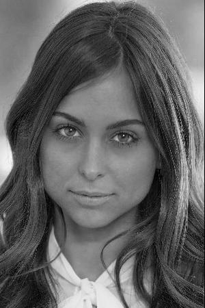

# ImReg
Image Registration Algorithms

Original image




Shifted image (5.3p in X, 6.7p in Y)


```python
from mi_reg import main_mi_reg
from poc_reg import main_poc_reg

dx, dy, match_height = main_mi_reg(im_orig, im_shifted)
print(dx, dy, match_height)
> -5.300313983855842 -6.699973244887778 0.9967009221534583

dx, dy, match_height = main_poc_reg(im_orig, im_shifted)
print(dx, dy, match_height)
> -5.299159785340295 -6.700930722501576 0.9797807076193092


```
